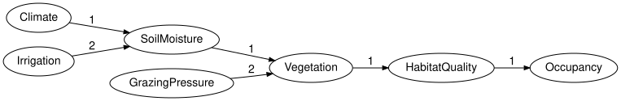

# Bayesian networks as networks of mechanisms
Simon Frost

- [Overview](#overview)
- [Setup](#setup)
- [Variables, states and mechanisms](#variables-states-and-mechanisms)
- [Validation](#validation)
- [The derived graph](#the-derived-graph)
- [Why “not just a DAG”](#why-not-just-a-dag)
- [Binding tables](#binding-tables)
- [Brute-force evaluation](#brute-force-evaluation)
- [Summary](#summary)
- [References](#references)

## Overview

A Bayesian network is usually introduced as a directed acyclic graph
whose nodes carry conditional probability tables ([Koller and Friedman
2009](#ref-KollerFriedman2009)). `BayesianNetworks.jl` takes a slightly
different view, the one that makes networks composable: a network is a
collection of *variables*, each with an ordered list of *states*, and a
collection of *mechanisms*, each of which generates one variable from an
ordered list of input variables. The graph is derived from the
mechanisms; it is not stored. Treating the mechanisms rather than the
arrows as the data is what lets a network with some variables left
ungenerated make sense, which is the categorical reading of a Bayesian
network as a causal theory ([Fong 2012](#ref-Fong2012)).

This vignette builds a reference ecological network – climate and
irrigation drive soil moisture, soil moisture and grazing pressure drive
vegetation, and vegetation determines habitat quality and hence
occupancy (the running example of the package specification) – then
inspects it, validates it and draws it. The companion vignettes cover
the wiring-diagram view and evaluation, observation versus intervention,
open networks and composition, serialisation, dynamic networks and model
cards.

## Setup

The package re-exports what it needs from ACSets and `FiniteKernels.jl`,
so this one `using` is enough.

``` julia
using BayesianNetworks
```

## Variables, states and mechanisms

The `bayesnet` function takes `name => states` pairs and a list of
`target => parents` mechanisms. Parent order matters: it fixes the axis
order of the conditional probability table that will later be bound to
the mechanism.

``` julia
bn = bayesnet(:Climate => [:dry, :normal, :wet],
              :Irrigation => [:low, :high],
              :SoilMoisture => [:low, :medium, :high],
              :GrazingPressure => [:low, :high],
              :Vegetation => [:sparse, :moderate, :dense],
              :HabitatQuality => [:poor, :good],
              :Occupancy => [:absent, :present];
              mechanisms = [:SoilMoisture => (:Climate, :Irrigation),
                            :Vegetation => (:SoilMoisture, :GrazingPressure),
                            :HabitatQuality => :Vegetation,
                            :Occupancy => :HabitatQuality])
```

<div class="c-set">
<span class="c-set-summary">BayesianNetworks.BayesNet {Variable:7, State:17, Mechanism:7, Input:6, Label:0, Position:0, Ref:0}</span>

| Variable |   variable_name | space_ref |
|---------:|----------------:|----------:|
|        1 |         Climate |   NoRef() |
|        2 |      Irrigation |   NoRef() |
|        3 |    SoilMoisture |   NoRef() |
|        4 | GrazingPressure |   NoRef() |
|        5 |      Vegetation |   NoRef() |
|        6 |  HabitatQuality |   NoRef() |
|        7 |       Occupancy |   NoRef() |

| State | state_variable | state_name | state_position |
|------:|---------------:|-----------:|---------------:|
|     1 |              1 |        dry |              1 |
|     2 |              1 |     normal |              2 |
|     3 |              1 |        wet |              3 |
|     4 |              2 |        low |              1 |
|     5 |              2 |       high |              2 |
|     6 |              3 |        low |              1 |
|     7 |              3 |     medium |              2 |
|     8 |              3 |       high |              3 |
|     9 |              4 |        low |              1 |
|    10 |              4 |       high |              2 |
|    11 |              5 |     sparse |              1 |
|    12 |              5 |   moderate |              2 |
|    13 |              5 |      dense |              3 |
|    14 |              6 |       poor |              1 |
|    15 |              6 |       good |              2 |
|    16 |              7 |     absent |              1 |
|    17 |              7 |    present |              2 |

| Mechanism | target |            mechanism_name | kernel_ref |
|----------:|-------:|--------------------------:|-----------:|
|         1 |      3 |    SoilMoisture_mechanism |    NoRef() |
|         2 |      5 |      Vegetation_mechanism |    NoRef() |
|         3 |      6 |  HabitatQuality_mechanism |    NoRef() |
|         4 |      7 |       Occupancy_mechanism |    NoRef() |
|         5 |      1 |         Climate_mechanism |    NoRef() |
|         6 |      2 |      Irrigation_mechanism |    NoRef() |
|         7 |      4 | GrazingPressure_mechanism |    NoRef() |

| Input | input_mechanism | input_variable | input_position |
|------:|----------------:|---------------:|---------------:|
|     1 |               1 |              1 |              1 |
|     2 |               1 |              2 |              2 |
|     3 |               2 |              3 |              1 |
|     4 |               2 |              4 |              2 |
|     5 |               3 |              5 |              1 |
|     6 |               4 |              6 |              1 |

</div>

The same network is available as `reference_habitat_bn()`. Every
variable that is not named as a target gets a mechanism without inputs
(a prior), so the network is *closed*: each variable has exactly one
generating mechanism.

``` julia
mechanism_names(bn)
```

    7-element Vector{Symbol}:
     :SoilMoisture_mechanism
     :Vegetation_mechanism
     :HabitatQuality_mechanism
     :Occupancy_mechanism
     :Climate_mechanism
     :Irrigation_mechanism
     :GrazingPressure_mechanism

The network is an attributed C-set (ACSet) on the schema `SchBayesNet`
([Patterson et al. 2022](#ref-PattersonLynchFairbanks2022)), with four
objects. There is no `Edge` object: an arrow from `Climate` to
`SoilMoisture` is an `Input` part saying that `Climate` is the first
argument of the mechanism generating `SoilMoisture`.

``` julia
(variables = nparts(bn, :Variable), states = nparts(bn, :State),
 mechanisms = nparts(bn, :Mechanism), inputs = nparts(bn, :Input))
```

    (variables = 7, states = 17, mechanisms = 7, inputs = 6)

Accessors return part ids; names are recovered with `variable_name`.
States and inputs are always returned in their recorded order
(`state_position`, `input_position`), never in part-id order.

``` julia
states(bn, :SoilMoisture)
```

    3-element Vector{Symbol}:
     :low
     :medium
     :high

`parents` gives the inputs of the mechanism generating a variable, in
the order that fixes the table’s axes:

``` julia
variable_name.(Ref(bn), parents(bn, :Vegetation))
```

    2-element Vector{Symbol}:
     :SoilMoisture
     :GrazingPressure

`children` reads the same `Input` parts the other way, listing every
variable whose mechanism consumes the given one:

``` julia
variable_name.(Ref(bn), children(bn, :SoilMoisture))
```

    1-element Vector{Symbol}:
     :Vegetation

## Validation

`validate` checks the structural rules of the specification: every
reference points at an existing part, state and input positions are
permutations, no mechanism reads its own target, the derived graph is
acyclic, and (with `closed = true`) every variable has exactly one
mechanism. It returns `nothing` when everything is fine and throws a
typed exception otherwise; `validation_errors` collects all problems.

``` julia
validate(bn; closed = true, unique_names = true)
```

Let us break the network on a copy: add a second mechanism for
`Occupancy` and an input that closes a cycle.

``` julia
broken = deepcopy(bn)
add_mechanism!(broken, :Occupancy; inputs = [:Climate], name = :second)
add_input!(broken, :Climate_mechanism, :Occupancy)
validation_errors(broken; closed = true)
```

    2-element Vector{Exception}:
     DuplicateGeneratorError(:Occupancy, 7, [4, 8])
     CyclicBayesNetError([:Climate, :SoilMoisture, :Vegetation, :HabitatQuality, :Occupancy], [1, 3, 5, 6, 7])

The mutating builders (`add_variable!`, `add_state!`, `add_mechanism!`,
`add_input!`) never validate, so intermediate states can be
inconsistent; everything else in the package treats networks as
immutable values and returns new ones.

## The derived graph

The DAG is a view: `variable_graph` builds a Graphs.jl `SimpleDiGraph`
with one vertex per variable and one edge per input, and
`topological_order` sorts the variables so that parents come first.

``` julia
variable_name.(Ref(bn), topological_order(bn))
```

    7-element Vector{Symbol}:
     :Climate
     :Irrigation
     :SoilMoisture
     :GrazingPressure
     :Vegetation
     :HabitatQuality
     :Occupancy

`to_graphviz` draws the same graph. Nodes are labelled with the variable
and its states; the result is a `Graphviz.Graph`, the package’s own DOT
syntax tree, which renders to SVG through the Graphviz binaries.

``` julia
to_graphviz(bn)
```


The layout direction and Graphviz attributes can be changed, and edges
can be labelled with the input position, which shows the parent order of
`SoilMoisture` and `Vegetation`:

``` julia
to_graphviz(bn; rankdir = "LR", states = false, edge_labels = true)
```



## Why “not just a DAG”

Three things distinguish this representation from a graph with tables
attached.

1.  **Mechanisms are first-class parts.** They have names and kernel
    references, so an intervention can replace one (the companion
    vignette on interventions), a composition can identify one across
    networks, and a refinement can substitute an open sub-network for
    one (the vignette on open networks). The graph never has to be
    edited; it follows the mechanisms.

2.  **Order is explicit.** State order and parent order are attributes,
    so they survive colimits, which renumber parts, and they make the
    axis convention of the tables unambiguous: a table bound to
    `Vegetation` has axes `(SoilMoisture, GrazingPressure, Vegetation)`
    because that is the recorded input order.

3.  **Syntax and semantics are separate.** The ACSet holds no numbers.
    Kernels live in a `BayesModel` wrapper, keyed by the `kernel_ref`
    attribute of each mechanism, so the same structure can carry
    different tables, a different semantics altogether, or none at all.

Canonical forms make the representation comparable: `canonicalize`
renumbers parts deterministically, so two networks built in different
orders compare equal.

``` julia
reversed = bayesnet(:Occupancy => [:absent, :present],
                    :HabitatQuality => [:poor, :good],
                    :Vegetation => [:sparse, :moderate, :dense],
                    :GrazingPressure => [:low, :high],
                    :SoilMoisture => [:low, :medium, :high],
                    :Irrigation => [:low, :high],
                    :Climate => [:dry, :normal, :wet];
                    mechanisms = [:Occupancy => :HabitatQuality,
                                  :HabitatQuality => :Vegetation,
                                  :Vegetation => (:SoilMoisture, :GrazingPressure),
                                  :SoilMoisture => (:Climate, :Irrigation)])
reversed == bn, canonicalize(reversed) == canonicalize(bn)
```

    (false, true)

## Binding tables

A `BayesModel` wraps the structure with spaces and kernels from
`FiniteKernels.jl`. `bind_cpt` takes a table in the parents-first,
child-last layout and checks its shape and normalisation against the
syntax.

``` julia
m = BayesModel(bn)
m = bind_cpt(m, :Climate => [0.3, 0.5, 0.2])
m = bind_cpt(m, :HabitatQuality => [0.85 0.15; 0.4 0.6; 0.15 0.85])   # rows = Vegetation
missing_kernels(m)
```

    5-element Vector{Symbol}:
     :SoilMoisture
     :Vegetation
     :Occupancy
     :Irrigation
     :GrazingPressure

`reference_habitat_model()` binds all seven tables.

``` julia
m = reference_habitat_model()
validate(m; closed = true, semantics = true)
kernel(m, :HabitatQuality)
```

    FiniteKernel{Float64}(Vegetation{sparse,moderate,dense} → HabitatQuality{poor,good})
            sparse  moderate  dense
      poor    0.85       0.4   0.15
      good    0.15       0.6   0.85

## Brute-force evaluation

With every mechanism bound, the model has a joint distribution: the
chain-rule product of the conditional probability tables ([Koller and
Friedman 2009](#ref-KollerFriedman2009)). `joint_distribution` computes
it by enumerating every assignment of the variables and multiplying the
mechanisms’ entries, which makes it an oracle for small models rather
than a scalable backend – `BayesianNetworkInference.jl` has the
algorithms that scale. The result is a `FiniteKernel` state
`I → Climate ⊗ ... ⊗ Occupancy`, so it carries its own axes.

``` julia
J = joint_distribution(m)
J.codom
```

    FiniteSpace(Climate{dry,normal,wet} ⊗ Irrigation{low,high} ⊗ SoilMoisture{low,medium,high} ⊗ GrazingPressure{low,high} ⊗ Vegetation{sparse,moderate,dense} ⊗ HabitatQuality{poor,good} ⊗ Occupancy{absent,present})

`joint_table` presents the same numbers as a table indexed by
assignments:

``` julia
jt = joint_table(m)
jt[:Climate => :dry, :Irrigation => :low, :SoilMoisture => :low,
   :GrazingPressure => :low, :Vegetation => :sparse, :HabitatQuality => :poor,
   :Occupancy => :absent]
```

    0.025704

Marginals and conditionals are the usual queries, computed from that
joint. Both take `evidence` (a model’s own evidence by default), and
`conditional` returns a kernel rather than a number, so a single entry
is read off with `probability`; extracting such a kernel from a joint
state is disintegration ([Cho and Jacobs 2019](#ref-ChoJacobs2019)).

``` julia
round.(marginal(m, :Occupancy).table; digits = 4)
```

    2-element Vector{Float64}:
     0.5238
     0.4762

``` julia
probability(conditional(m, :Occupancy, :Vegetation), :present, :dense)
```

    0.6675

`sample` draws ancestrally in topological order, each variable from its
mechanism’s kernel given the sampled parents. With enough draws the
empirical frequencies approach the marginal, which is a cheap
independent check on the enumeration:

``` julia
using Random

draws = sample(m, 20_000; rng = MersenneTwister(2026))
emp = empirical_marginal(draws, :Occupancy, space(m, :Occupancy))
round.(emp.table; digits = 3), round.(marginal(m, :Occupancy).table; digits = 3)
```

    ([0.524, 0.476], [0.524, 0.476])

``` julia
maximum(abs.(emp.table .- marginal(m, :Occupancy).table)) < 0.02
```

    true

## Summary

A network here is variables, states and mechanisms stored as an ACSet;
the DAG, `parents`, `children` and `topological_order` are all views
derived from the `Input` parts, and `validate` checks the structural
rules in one place. Syntax carries no numbers: a `BayesModel` binds a
`FiniteKernel` per mechanism, so the same structure can carry different
tables or none, and `joint_distribution`, `marginal`, `conditional` and
`sample` read the semantics off the bound model by brute force. The next
vignette, [Observation versus
intervention](02_observation_vs_intervention.md),
separates conditioning from the `do` operator. The categorical view –
the same structure as a string diagram, evaluated in **FinStoch** – is
the first vignette of `CategoricalBayesianNetworks.jl`.

## References

<div id="refs" class="references csl-bib-body hanging-indent">

<div id="ref-ChoJacobs2019" class="csl-entry">

Cho, Kenta, and Bart Jacobs. 2019. “Disintegration and Bayesian
Inversion via String Diagrams.” *Mathematical Structures in Computer
Science* 29 (7): 938–71. <https://doi.org/10.1017/S0960129518000488>.

</div>

<div id="ref-Fong2012" class="csl-entry">

Fong, Brendan. 2012. *Causal Theories: A Categorical Perspective on
Bayesian Networks*. <https://arxiv.org/abs/1301.6201>.

</div>

<div id="ref-KollerFriedman2009" class="csl-entry">

Koller, Daphne, and Nir Friedman. 2009. *Probabilistic Graphical Models:
Principles and Techniques*. MIT Press.

</div>

<div id="ref-PattersonLynchFairbanks2022" class="csl-entry">

Patterson, Evan, Owen Lynch, and James Fairbanks. 2022. “Categorical
Data Structures for Technical Computing.” *Compositionality* 4 (5).
<https://doi.org/10.32408/compositionality-4-5>.

</div>

</div>
