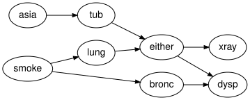

# Serialisation, provenance and CatColab export
Simon Frost

- [Overview](#overview)
- [Setup](#setup)
- [The package’s own JSON](#the-packages-own-json)
- [Interchange formats](#interchange-formats)
- [The presentation of the free Markov
  category](#the-presentation-of-the-free-markov-category)
- [CatColab export](#catcolab-export)
- [The schema emitted by the Lean
  project](#the-schema-emitted-by-the-lean-project)
- [Summary](#summary)
- [References](#references)

## Overview

A model has three layers that travel separately: the structure (an
ACSet), the semantics (spaces and kernels) and the provenance (evidence
and the history of rewrites). This vignette writes and reads the
package’s own JSON, reads networks from the interchange formats
supported by `BayesianNetworkFormats.jl`, exports the generators of the
free Markov-category presentation, exports the schema and an instance to
CatColab’s document format, and checks the schema against the one
emitted by the Lean project.

## Setup

`acset_schema` is needed once, for the CatColab round trip at the end.

``` julia
using BayesianNetworks
using JSON3
using ACSets: acset_schema

m = reference_habitat_model()
mechanism_names(syntax(m))
```

    7-element Vector{Symbol}:
     :SoilMoisture_mechanism
     :Vegetation_mechanism
     :HabitatQuality_mechanism
     :Occupancy_mechanism
     :Climate_mechanism
     :Irrigation_mechanism
     :GrazingPressure_mechanism

## The package’s own JSON

`json_bayesnet` writes the structure alone, in an envelope that records
the format and schema version around ACSets’ own JSON representation.
`KernelRef` attributes become objects with a `"type"` discriminator.

``` julia
js = json_bayesnet(syntax(m))
first(js, 120)
```

    "{\"format\":\"bayesnet-acset\",\"schema_version\":\"0.1\",\"acset\":{\"Variable\":[{\"_id\":1,\"variable_name\":\"Climate\",\"space_ref\":{\""

``` julia
canonicalize(parse_json_bayesnet(js)) == canonicalize(syntax(m))
```

    true

`json_model` adds the semantics (spaces and kernel tables, flattened
column-major), the evidence, the history and the extras. A round trip
through a file preserves everything, including the provenance of an
intervened model:

``` julia
m2 = soft_intervention(do_intervention(observe(m, :Climate => :dry), :Vegetation => :dense),
                       :Occupancy => NamedRef("policy"); parents = [:Vegetation],
                       note = "occupancy under management")
path = tempname() * ".json"
write_json_model(path, m2)
m3 = read_json_model(path)
(m3 ≈ m2, evidence(m3) == evidence(m2), history(m3) == history(m2))
```

    (true, true, true)

``` julia
[(e.kind, e.target, e.note) for e in history(m3)]
```

    2-element Vector{Tuple{Symbol, Symbol, String}}:
     (:hard, :Vegetation, "")
     (:soft, :Occupancy, "occupancy under management")

The kernels are keyed by reference, and references are attributes of the
syntax, so a reference that does not resolve (here the `policy` kernel
that was never bound) is simply reported as missing:

``` julia
missing_kernels(m3)
```

    1-element Vector{Symbol}:
     :Occupancy

## Interchange formats

`read_bayesnet` reads Netica `.dne`, GeNIe `.xdsl`, HUGIN `.net`, BIF,
DSC and UAI files through `BayesianNetworkFormats.jl` and returns a
`BayesModel` with every table bound (chance nodes only). The reference
network shipped as a fixture in Netica format is the same model as
`reference_habitat_model()`:

``` julia
mf = read_bayesnet(fixture_path("dne/habitat_reference.dne"))
mf ≈ m
```

    true

Titles, positions and comments from the file are kept in `extras`,
outside the semantics:

``` julia
sort(collect(keys(extras(mf))))
```

    9-element Vector{Symbol}:
     :comments
     :deterministic
     :format
     :name
     :network_extras
     :positions
     :source
     :titles
     :variable_extras

The classic *asia* network ([Lauritzen and Spiegelhalter
1988](#ref-LauritzenSpiegelhalter1988)) in BIF format:

``` julia
asia = read_bayesnet(fixture_path("bif/asia.bif"))
round.(marginal(asia, :dysp).table; digits = 4)
```

    2-element Vector{Float64}:
     0.436
     0.564

``` julia
to_graphviz(asia; states = false, rankdir = "LR")
```



`write_bayesnet` writes in any of the formats; the extension selects the
format.

``` julia
out = tempname() * ".xdsl"
write_bayesnet(out, m)
read_bayesnet(out) ≈ m
```

    true

## The presentation of the free Markov category

`presentation_json` lists the generators of the free Markov-category
presentation behind `to_free_expression`: one object per variable, with
its states, and one morphism per mechanism with its ordered domain,
codomain and kernel reference. This is the input for a future
Bayesian-network theory in CatColab.

``` julia
pj = presentation_json(m)
JSON3.pretty(JSON3.write(JSON3.read(pj)[:generators][3]))
```

    {
        "name": "HabitatQuality_mechanism",
        "dom": [
            "Vegetation"
        ],
        "cod": [
            "HabitatQuality"
        ],
        "kernel_ref": {
            "type": "NamedRef",
            "id": "HabitatQuality_mechanism"
        }
    }

``` julia
canonicalize(parse_presentation_json(pj)) == canonicalize(syntax(m))
```

    true

## CatColab export

CatColab does not yet have a Bayesian-network theory, so the export is
one-way: the ACSet schema ([Patterson et al.
2022](#ref-PattersonLynchFairbanks2022)) becomes a model of CatColab’s
`simple-schema` theory, and a network becomes a diagram in that model.
Identifiers are UUID v5 names in a fixed namespace, so the documents are
reproducible.

`catcolab_schema_document` writes the schema as a model document with
one cell per generator. Objects are typed `Entity` (for `Ob`) or
`AttrType`, morphisms `Hom(Entity)` (for homs) or `Attr` (for
attributes):

``` julia
doc = catcolab_schema_document(BayesNet)
doc["type"], doc["theory"], doc["version"], length(doc["notebook"]["cellOrder"])
```

    ("model", "simple-schema", "1", 18)

The first cell declares the `Variable` object and the eighth the
`state_variable` morphism:

``` julia
cell(doc, i) = doc["notebook"]["cellContents"][doc["notebook"]["cellOrder"][i]]
JSON3.pretty(JSON3.write(cell(doc, 1)))
```

    {
        "tag": "formal",
        "id": "9a8901a0-0c49-566f-ab4c-a59a5740f158",
        "content": {
            "tag": "object",
            "name": "Variable",
            "id": "95c5cb94-973e-56e9-9236-3697a88e9b20",
            "obType": {
                "tag": "Basic",
                "content": "Entity"
            }
        }
    }

A morphism cell names its domain and codomain by the UUIDs of the object
cells, which is why the identifiers have to be reproducible:

``` julia
JSON3.pretty(JSON3.write(cell(doc, 8)))
```

    {
        "tag": "formal",
        "id": "25bff265-cefd-55b3-8b31-0971020faa49",
        "content": {
            "tag": "morphism",
            "name": "state_variable",
            "id": "023bbf48-9d78-5edf-8f2f-3af9a17eff0f",
            "morType": {
                "tag": "Hom",
                "content": {
                    "tag": "Basic",
                    "content": "Entity"
                }
            },
            "dom": {
                "tag": "Basic",
                "content": "2b91654b-e1c1-51d8-a3a9-90f43b060c90"
            },
            "cod": {
                "tag": "Basic",
                "content": "95c5cb94-973e-56e9-9236-3697a88e9b20"
            }
        }
    }

`parse_catcolab_schema` reads such a document back (mirroring the parser
in CatColab’s Julia interop) and recovers the schema of `BayesNet`:

``` julia
parse_catcolab_schema(JSON3.write(doc)) == acset_schema(BayesNet())
```

    true

`catcolab_instance_document` writes a network as a diagram in the
schema: one object cell per part, labelled by name, and one morphism
cell per hom value.

``` julia
inst = catcolab_instance_document(reference_habitat_bn(), doc)
cells = [cell(inst, i) for i in eachindex(inst["notebook"]["cellOrder"])]
count(c -> c["content"]["tag"] == "object", cells), count(c -> c["content"]["tag"] == "morphism", cells)
```

    (37, 36)

``` julia
JSON3.pretty(JSON3.write(cells[1]["content"]))
```

    {
        "tag": "object",
        "name": "Climate",
        "id": "5467c7dd-b51b-5211-b8c4-14f86af97670",
        "obType": {
            "tag": "Basic",
            "content": "Entity"
        },
        "over": {
            "tag": "Basic",
            "content": "95c5cb94-973e-56e9-9236-3697a88e9b20"
        }
    }

The `catlog`-side `Model{obGenerators, morGenerators}` shape consumed by
CatColab’s Julia interop is available as `catcolab_model(BayesNet)`.

## The schema emitted by the Lean project

The Lean project in `proofs/` ([Moura and Ullrich
2021](#ref-deMouraUllrich2021); [The mathlib Community
2020](#ref-Mathlib2020)) defines the same schema and emits it as ACSets
JSON with `lake exe emit_schema`. The test suite compares it with
`schema_json(BayesNet)`, ignoring the version block; the same check is
reproduced here when the emitted file is present.

``` julia
lean_file = joinpath(pkgdir(BayesianNetworks), "proofs", "schemas", "bayesnet.schema.json")
strip_version(x) = filter(kv -> kv.first != :version, copy(JSON3.read(JSON3.write(x))))
if isfile(lean_file)
    lean = strip_version(JSON3.read(read(lean_file, String)))
    lean == strip_version(schema_json(BayesNet))
else
    "proofs/schemas/bayesnet.schema.json not emitted in this checkout"
end
```

    true

``` julia
[d["name"] for d in schema_json(BayesNet)["Hom"]]
```

    4-element Vector{String}:
     "state_variable"
     "target"
     "input_mechanism"
     "input_variable"

## Summary

Structure, semantics and provenance are written and read separately:
`json_bayesnet` carries the ACSet alone, `json_model` adds kernels,
evidence and the history of rewrites, and the interchange readers bring
in networks written by Netica, GeNIe, HUGIN and the BIF and DSC tools,
keeping their titles and layout in `extras` rather than in the
semantics. The presentation and CatColab exports expose the same model
as a categorical presentation, and the Lean-emitted schema is compared
against the Julia `@present` so the two stay in step. The next vignette,
[Dynamic Bayesian
networks](04_dynamic_networks.md), builds
time-indexed models that unroll into ordinary ones.

## References

```@raw html
<div id="refs" class="references csl-bib-body hanging-indent">
```

```@raw html
<div id="ref-LauritzenSpiegelhalter1988" class="csl-entry">
```

Lauritzen, Steffen L., and David J. Spiegelhalter. 1988. “Local
Computations with Probabilities on Graphical Structures and Their
Application to Expert Systems.” *Journal of the Royal Statistical
Society, Series B* 50 (2): 157–224.
<https://doi.org/10.1111/j.2517-6161.1988.tb01721.x>.

```@raw html
</div>
```

```@raw html
<div id="ref-deMouraUllrich2021" class="csl-entry">
```

Moura, Leonardo de, and Sebastian Ullrich. 2021. “The Lean 4 Theorem
Prover and Programming Language.” *Automated Deduction (CADE 28)*,
Lecture notes in computer science, vol. 12699: 625–35.
<https://doi.org/10.1007/978-3-030-79876-5_37>.

```@raw html
</div>
```

```@raw html
<div id="ref-PattersonLynchFairbanks2022" class="csl-entry">
```

Patterson, Evan, Owen Lynch, and James Fairbanks. 2022. “Categorical
Data Structures for Technical Computing.” *Compositionality* 4 (5).
<https://doi.org/10.32408/compositionality-4-5>.

```@raw html
</div>
```

```@raw html
<div id="ref-Mathlib2020" class="csl-entry">
```

The mathlib Community. 2020. “The Lean Mathematical Library.”
*Proceedings of the 9th ACM SIGPLAN International Conference on
Certified Programs and Proofs (CPP 2020)*, 367–81.
<https://doi.org/10.1145/3372885.3373824>.

```@raw html
</div>
```

```@raw html
</div>
```
