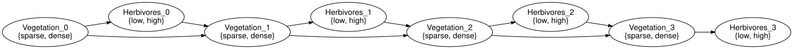
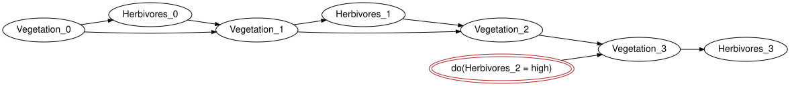

# Dynamic networks: templates and unrolling
Simon Frost

- [Overview](#overview)
- [Setup](#setup)
- [The template](#the-template)
- [Unrolling](#unrolling)
- [A lag-three boundary is three initial
  slices](#a-lag-three-boundary-is-three-initial-slices)
- [Unrolling is gluing](#unrolling-is-gluing)
- [Semantics](#semantics)
- [Forward marginals](#forward-marginals)
- [Intervening in one slice](#intervening-in-one-slice)
- [Management as an exogenous input](#management-as-an-exogenous-input)
- [Summary](#summary)
- [References](#references)

## Overview

Ecological feedback is a cycle: vegetation feeds herbivores and
herbivores eat vegetation. A Bayesian network cannot hold a cycle, but a
*dynamic* Bayesian network can, by placing the two halves of the loop in
different time slices: `Vegetation_t -> Herbivores_t` within a slice and
`Herbivores_{t-1} -> Vegetation_t` across slices, which is the standard
two-slice presentation of a dynamic Bayesian network ([Koller and
Friedman 2009](#ref-KollerFriedman2009)). `BayesianNetworks.jl`
represents such a model as a *template* (`DynamicBayesNet`) that
`unroll` compiles, for any finite horizon, into an ordinary closed
network. Every facility of the package then applies unchanged:
validation, evaluation, evidence, interventions, drawing and, through
`BayesianNetworkInference.jl`, variable elimination on long horizons –
the operation whose categorical form is marginalisation in a Markov
category ([Lorenzin and Zanasi 2025](#ref-LorenzinZanasi2025)).

## Setup

``` julia
using BayesianNetworks
```

## The template

A template has two parts, both plain `BayesNet`s. The *transition*
template describes a generic slice `t`: its *current* variables
(`Vegetation`, `Herbivores`) have mechanisms, and its *lagged*
variables, named with the convention `lagged(:X, k)` (`X[t-1]`,
`X[t-2]`, …), are exogenous stand-ins for earlier slices. The *initial*
network is a closed network over the first slice. The example below is
`vegetation_herbivore_dbn()`.

``` julia
initial = bayesnet(:Vegetation => [:sparse, :dense], :Herbivores => [:low, :high];
                   mechanisms = [:Herbivores => :Vegetation])
transition = bayesnet(:Vegetation => [:sparse, :dense], :Herbivores => [:low, :high],
                      lagged(:Vegetation, 1) => [:sparse, :dense],
                      lagged(:Herbivores, 1) => [:low, :high];
                      mechanisms = [:Vegetation => (lagged(:Vegetation, 1),
                                                    lagged(:Herbivores, 1)),
                                    :Herbivores => :Vegetation],
                      closed = false)
dbn = DynamicBayesNet(initial, transition)
```

    DynamicBayesNet(2 variables per slice, 2 lagged inputs, lags = 1)

``` julia
current_variables(dbn), lagged_variables(dbn), lags(dbn)
```

    ([:Vegetation, :Herbivores], [Symbol("Vegetation[t-1]"), Symbol("Herbivores[t-1]")], 1)

The constructor validates the template: every current variable needs a
mechanism, lagged variables must not have one, every `X[t-k]` must be a
lag of a current `X` with the same states, and the initial network must
cover exactly the current variables.

``` julia
bad = bayesnet(:Vegetation => [:sparse, :dense], :Herbivores => [:low, :high],
               lagged(:Vegetation, 1) => [:sparse, :dense];
               mechanisms = [:Vegetation => lagged(:Vegetation, 1)], closed = false)
try
    DynamicBayesNet(initial, bad)
catch e
    sprint(showerror, e)
end
```

    "DynamicTemplateError (missing_mechanism): variable :Herbivores: current variable of the transition has no mechanism"

## Unrolling

`unroll(dbn, h)` builds the closed network over slices `0, ..., h`.
Variables are named `variable_at(:X, t)`, that is `X_t`; slice 0 comes
from the initial network and every later slice from the transition
template, with each lagged input `X[t-k]` wired to `X_{t-k}`. The
boundary is exact: with maximal lag `L` the initial network covers
slices `0` to `L - 1` (for `L = 1`, just slice 0), so no lagged parent
is ever missing.

``` julia
u = unroll(dbn, 3)
validate(u; closed = true, unique_names = true)
variable_names(u)
```

    8-element Vector{Symbol}:
     :Vegetation_0
     :Herbivores_0
     :Vegetation_1
     :Herbivores_1
     :Vegetation_2
     :Herbivores_2
     :Vegetation_3
     :Herbivores_3

``` julia
variable_name.(Ref(u), parents(u, :Vegetation_2))
```

    2-element Vector{Symbol}:
     :Vegetation_1
     :Herbivores_1

`Vegetation_2` reads slice 1, so the lag has become an ordinary arrow
between slices, which the drawing lays out left to right:

``` julia
to_graphviz(u; rankdir = "LR")
```



`slice_variables` and `horizon` read the slice structure back from the
names:

``` julia
slice_variables(u, 2), horizon(u)
```

    ([:Vegetation_2, :Herbivores_2], 3)

## A lag-three boundary is three initial slices

For maximal lag three, the initial network supplies slices 0, 1 and 2
jointly. Its lag notation is relative to slice 2: `X[t-2]`, `X[t-1]` and
`X` become `X_0`, `X_1` and `X_2`. They need not have the same initial
distribution.

``` julia
initial3 = bayesnet(lagged(:X, 2) => [:no, :yes],
                   lagged(:X, 1) => [:no, :yes], :X => [:no, :yes])
transition3 = bayesnet(:X => [:no, :yes], lagged(:X, 3) => [:no, :yes];
                      mechanisms = [:X => lagged(:X, 3)], closed = false)
dm3 = DynamicBayesModel(DynamicBayesNet(initial3, transition3))
dm3 = bind_cpt(dm3, [lagged(:X, 2) => [0.9, 0.1],
                    lagged(:X, 1) => [0.5, 0.5], :X => [0.2, 0.8]]; slice = :initial)
dm3 = bind_cpt(dm3, :X => [0.8 0.2; 0.1 0.9])
u3 = unroll(dm3, 5)
[(slice = t,
  parents = variable_name.(Ref(syntax(u3)), parents(syntax(u3), variable_at(:X, t))),
  probability_yes = round(marginal(u3, variable_at(:X, t)).table[2]; digits = 4))
 for t in 0:5]
```

    6-element Vector{NamedTuple{(:slice, :parents, :probability_yes)}}:
     (slice = 0, parents = Any[], probability_yes = 0.1)
     (slice = 1, parents = Any[], probability_yes = 0.5)
     (slice = 2, parents = Any[], probability_yes = 0.8)
     (slice = 3, parents = [:X_0], probability_yes = 0.27)
     (slice = 4, parents = [:X_1], probability_yes = 0.55)
     (slice = 5, parents = [:X_2], probability_yes = 0.76)

The first transition is at slice 3, reading slice 0, not an invented
negative slice or a repeated copy of the slice-2 initial state. Since
the transition sends a probability `p` to `0.2 + 0.7p`, slices 3, 4 and
5 have probabilities 0.27, 0.55 and 0.76. Dropping the missing lag or
reusing one initial marginal for all three slices would change those
numbers.

## Unrolling is gluing

The unrolled network is what the open-network machinery produces when
consecutive slices are glued along the lagged variables, as structured
cospans ([Baez and Courser 2020](#ref-BaezCourser2020)). `initial_slice`
is the initial network renamed to slice 0 and `transition_slice(dbn, t)`
the transition template seen from slice `t`, with the lagged variables
exogenous.

``` julia
variable_names(initial_slice(dbn)), variable_names(transition_slice(dbn, 1))
```

    ([:Vegetation_0, :Herbivores_0], [:Vegetation_1, :Herbivores_1, :Vegetation_0, :Herbivores_0])

Gluing the outputs of the first to the inputs of the second gives
`unroll(dbn, 1)` up to renumbering. `Open` and `glue` live in
`CategoricalBayesianNetworks.jl`, which shows that identity as a worked
example; `unroll` builds the network directly rather than by repeated
pushouts, and both test suites keep the two constructions in agreement.

## Semantics

A `DynamicBayesModel` carries a `BayesModel` for each template. Kernels
are bound with `bind_cpt` (or `bind_kernel`) on the chosen `slice`; the
domain axes of a transition kernel are named like the template’s inputs,
lagged names included. `vegetation_herbivore_model()` binds fixed
tables: vegetation recovers when herbivores are few and declines when
they are many, and herbivores track vegetation.

``` julia
dm = vegetation_herbivore_model()
kernel(dm, :Vegetation)
```

    FiniteKernel{Float64}(Vegetation[t-1]{sparse,dense} ⊗ Herbivores[t-1]{low,high} → Vegetation{sparse,dense})
              sparse,low  dense,low  sparse,high  dense,high
      sparse         0.5        0.1          0.8         0.4
      dense          0.5        0.9          0.2         0.6

``` julia
round.(kernel(dm, :Vegetation).table; digits = 2)   # outputs-first: (Vegetation, Vegetation[t-1], Herbivores[t-1])
```

    2×2×2 Array{Float64, 3}:
    [:, :, 1] =
     0.5  0.1
     0.5  0.9

    [:, :, 2] =
     0.8  0.4
     0.2  0.6

`unroll` on the model copies the kernels into every slice, renaming
their axes, so the result is an ordinary model with semantics.

``` julia
um = unroll(dm, 3)
validate(um; closed = true, unique_names = true, semantics = true)
names(kernel(um, :Vegetation_2).dom)
```

    2-element Vector{Symbol}:
     :Vegetation_1
     :Herbivores_1

## Forward marginals

`rollout` returns the marginal of a variable in every slice (brute force
through `marginal`, fine for short horizons); `filter_marginal` asks for
one slice, given the model’s evidence.

``` julia
rv = rollout(um, :Vegetation)
rh = rollout(um, :Herbivores)
fmt(x) = lpad(string(round(x; digits = 4)), 8)
println(" t   P(Vegetation = dense)   P(Herbivores = high)")
for t in 0:horizon(syntax(um))
    println(lpad(t, 2), "   ", lpad(fmt(rv[t + 1].table[2]), 21), "   ",
            lpad(fmt(rh[t + 1].table[2]), 20))
end
```

     t   P(Vegetation = dense)   P(Herbivores = high)
     0                     0.6                   0.54
     1                   0.578                 0.5312
     2                  0.5718                 0.5287
     3                  0.5701                  0.528

The same numbers follow from the forward recursion of the two-variable
chain: the joint of `(Vegetation_t, Herbivores_t)` composed with the
transition kernel gives the next vegetation marginal. Kernels compose,
so this is one line.

``` julia
J0 = marginal(um, [:Vegetation_0, :Herbivores_0])
T = kernel(um, :Vegetation_1)
compose_kernel(J0, T).table ≈ rv[2].table
```

    true

Evidence in one slice propagates both forwards (filtering) and backwards
(smoothing):

``` julia
ume = observe(um, :Herbivores_1 => :high)
(round.(filter_marginal(ume, :Vegetation, 2).table; digits = 4),
 round.(filter_marginal(ume, :Vegetation, 0).table; digits = 4))
```

    ([0.4953, 0.5047], [0.3494, 0.6506])

For long horizons the unrolled model is just a large network:
`BayesianNetworkInference.infer` answers the same queries by variable
elimination without enumerating the joint.

## Intervening in one slice

An intervention on `Herbivores_2` is a local rewrite of the unrolled
network: the mechanism of that one variable is replaced by a point mass.
Earlier slices are untouched and later ones respond.

``` julia
umi = do_intervention(um, :Herbivores_2 => :high)
rvi = rollout(umi, :Vegetation)
println(" t   P(dense)   P(dense | do(Herbivores_2 = high))")
for t in 0:3
    println(lpad(t, 2), "   ", fmt(rv[t + 1].table[2]), "   ", fmt(rvi[t + 1].table[2]))
end
```

     t   P(dense)   P(dense | do(Herbivores_2 = high))
     0        0.6        0.6
     1      0.578      0.578
     2     0.5718     0.5718
     3     0.5701     0.4287

``` julia
to_graphviz(umi; rankdir = "LR", states = false)
```



Observation of the same event, by contrast, also moves the earlier
slices:

``` julia
rvo = rollout(observe(um, :Herbivores_2 => :high), :Vegetation)
round.([k.table[2] for k in rvo]; digits = 4)
```

    4-element Vector{Float64}:
     0.6142
     0.6297
     0.7571
     0.5028

## Management as an exogenous input

`vegetation_herbivore_dbn(management = true)` adds an exogenous
`Management` variable (`none`, `cull`) to every slice, feeding the
herbivore mechanism. Setting it in one slice by evidence or intervention
gives the same downstream effect, because it has no parents.

``` julia
umm = unroll(vegetation_herbivore_model(management = true), 3)
(round.(marginal(umm, :Vegetation_3).table; digits = 4),
 round.(marginal(umm, :Vegetation_3; evidence = Dict(:Management_2 => :cull)).table; digits = 4),
 round.(marginal(do_intervention(umm, :Management_2 => :cull), :Vegetation_3).table; digits = 4))
```

    ([0.4088, 0.5912], [0.3466, 0.6534], [0.3466, 0.6534])

## Summary

- A `DynamicBayesNet` is an initial network plus a transition template
  whose lagged inputs follow the `X[t-k]` naming convention; `validate`
  checks the template.
- `unroll(dbn, h)` compiles a finite horizon into a closed `BayesNet`
  with variables `X_t`; on a `DynamicBayesModel` the kernels are copied
  per slice.
- Unrolling agrees with gluing consecutive slices as open networks.
- `rollout` and `filter_marginal` give forward marginals by brute force;
  evidence and interventions on individual slices work as in any other
  model.

The next vignette, [Model cards and
provenance](05_model_cards_and_provenance.md),
documents a finished model rather than computing with it.

## References

<div id="refs" class="references csl-bib-body hanging-indent">

<div id="ref-BaezCourser2020" class="csl-entry">

Baez, John C., and Kenny Courser. 2020. “Structured Cospans.” *Theory
and Applications of Categories* 35 (48): 1771–822.

</div>

<div id="ref-KollerFriedman2009" class="csl-entry">

Koller, Daphne, and Nir Friedman. 2009. *Probabilistic Graphical Models:
Principles and Techniques*. MIT Press.

</div>

<div id="ref-LorenzinZanasi2025" class="csl-entry">

Lorenzin, Antonio, and Fabio Zanasi. 2025. *Bayesian Networks, Markov
Networks, Moralisation, Triangulation: A Categorical Perspective*.
<https://arxiv.org/abs/2512.09908>.

</div>

</div>
