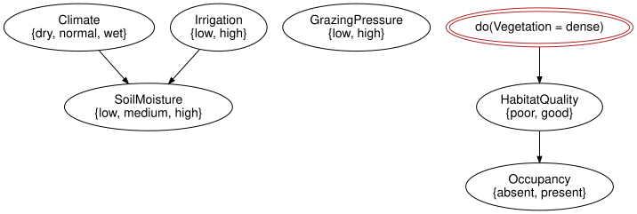
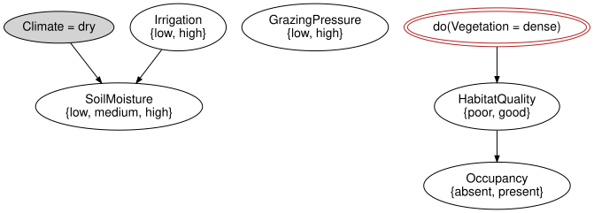

# Observation versus intervention
Simon Frost

- [Overview](#overview)
- [Setup](#setup)
- [A chain](#a-chain)
- [A fork](#a-fork)
- [What the intervention does to the
  network](#what-the-intervention-does-to-the-network)
- [Downstream agreement needs a screening-off
  condition](#downstream-agreement-needs-a-screening-off-condition)
- [Soft interventions](#soft-interventions)
- [Provenance](#provenance)
- [Summary](#summary)
- [References](#references)

## Overview

Seeing that the vegetation is dense and forcing the vegetation to be
dense are different operations with different consequences ([Pearl
2009](#ref-Pearl2009)). `observe` records evidence and leaves the
network untouched; `do_intervention` rewrites the network, replacing the
mechanism of the intervened variable by a constant – the “cut” that
string-diagram surgery performs on a causal model ([Jacobs et al.
2019](#ref-JacobsKissingerZanasi2019); [Lorenz and Tull
2023](#ref-LorenzTull2023)). This vignette compares the two numerically
on a chain and on a fork, then on the reference network, and reads the
provenance of the rewrites from the model’s history.

## Setup

``` julia
using BayesianNetworks
```

## A chain

In the chain `Rain → Sprinkler → Wet`, observing the sprinkler tells us
something about the rain (the sprinkler is turned on less on rainy
days); switching it on by hand does not.

``` julia
chain = bayesnet(:Rain => [:no, :yes], :Sprinkler => [:off, :on], :Wet => [:dry, :wet];
                 mechanisms = [:Sprinkler => :Rain, :Wet => :Sprinkler])
c = BayesModel(chain)
c = bind_cpt(c, [:Rain => [0.7, 0.3],
                 :Sprinkler => [0.5 0.5; 0.9 0.1],     # rows = Rain
                 :Wet => [0.9 0.1; 0.2 0.8]])          # rows = Sprinkler
round.(marginal(c, :Rain).table; digits = 4)
```

    2-element Vector{Float64}:
     0.7
     0.3

Observing the sprinkler on shifts the belief about the rain, because a
sprinkler that is on is weak evidence for a dry day:

``` julia
round.(marginal(observe(c, :Sprinkler => :on), :Rain).table; digits = 4)
```

    2-element Vector{Float64}:
     0.9211
     0.0789

Switching the sprinkler on by hand changes nothing upstream: the
rewritten network has no arrow into `Sprinkler` left for the information
to travel back along.

``` julia
round.(marginal(do_intervention(c, :Sprinkler => :on), :Rain).table; digits = 4)
```

    2-element Vector{Float64}:
     0.7
     0.3

Downstream, the two agree: `Wet` depends on `Sprinkler` only through its
own mechanism, which neither operation touches.

``` julia
marginal(observe(c, :Sprinkler => :on), :Wet).table ≈
    marginal(do_intervention(c, :Sprinkler => :on), :Wet).table
```

    true

## A fork

In the fork `Season → Rain` and `Season → Sprinkler`, rain and sprinkler
are dependent through the common cause. Observing rain changes the
belief about the sprinkler; making it rain does not.

``` julia
fork = bayesnet(:Season => [:dry, :wet], :Rain => [:no, :yes], :Sprinkler => [:off, :on];
                mechanisms = [:Rain => :Season, :Sprinkler => :Season])
f = BayesModel(fork)
f = bind_cpt(f, [:Season => [0.5, 0.5],
                 :Rain => [0.9 0.1; 0.3 0.7],          # rows = Season
                 :Sprinkler => [0.2 0.8; 0.8 0.2]])    # rows = Season
(marginal(f, :Sprinkler).table,
 marginal(observe(f, :Rain => :yes), :Sprinkler).table,
 marginal(do_intervention(f, :Rain => :yes), :Sprinkler).table)
```

    ([0.5, 0.5], [0.725, 0.275], [0.5, 0.5])

## What the intervention does to the network

`do_intervention` is a local rewrite of the ACSet: the mechanism of the
variable and its inputs are removed, and a mechanism with no inputs and
a `PointMassRef` is added. Nothing else changes; the graph loses the
incoming edges of the variable. The distribution of the rewritten
network is therefore the truncated factorisation ([Pearl
2009](#ref-Pearl2009)): the same product of conditional probability
tables, with the factor for the intervened variable replaced by a point
mass.

``` julia
m = reference_habitat_model()
md = do_intervention(m, :Vegetation => :dense)
mechanism_names(syntax(md))
```

    7-element Vector{Symbol}:
     :SoilMoisture_mechanism
     :GrazingPressure_mechanism
     :HabitatQuality_mechanism
     :Occupancy_mechanism
     :Climate_mechanism
     :Irrigation_mechanism
     Symbol("do[Vegetation=dense]")

``` julia
Symbol[variable_name(syntax(md), p) for p in parents(syntax(md), :Vegetation)]
```

    Symbol[]

`Vegetation` has no parents left, and the drawing shows the two arrows
that used to enter it are gone:

``` julia
to_graphviz(md)
```



The point mass is materialised on demand as a kernel, so evaluation
works as before:

``` julia
kernel(md, :Vegetation).table
```

    3-element Vector{Float64}:
     0.0
     0.0
     1.0

Upstream of `Vegetation`, observation moves `SoilMoisture` and
intervention does not; downstream, both give the same numbers.

``` julia
mo = observe(m, :Vegetation => :dense)
(round.(marginal(m, :SoilMoisture).table; digits = 4),
 round.(marginal(mo, :SoilMoisture).table; digits = 4),
 round.(marginal(md, :SoilMoisture).table; digits = 4))
```

    ([0.288, 0.403, 0.309], [0.0834, 0.35, 0.5666], [0.288, 0.403, 0.309])

``` julia
marginal(mo, :Occupancy) ≈ marginal(md, :Occupancy)
```

    true

Evidence lives in the wrapper, so a model can carry both: `observe` on
an intervened model conditions the interventional distribution.

``` julia
mdo = observe(md, :Climate => :dry)
evidence(mdo), intervened_variables(mdo)
```

    (Dict(:Climate => :dry), [:Vegetation])

``` julia
to_graphviz(mdo)
```



## Downstream agreement needs a screening-off condition

The previous example does not establish that observation and
intervention always agree downstream. An unobserved common cause can
also affect a downstream target through a path that bypasses the
manipulated variable:

``` julia
confounded = bayesnet(:U => [:no, :yes], :X => [:no, :yes], :Y => [:no, :yes];
                     mechanisms = [:X => :U, :Y => (:U, :X)])
response = zeros(2, 2, 2)
for u in 1:2, x in 1:2
    response[u, x, u == 2 && x == 2 ? 2 : 1] = 1.0
end
cm = bind_cpt(BayesModel(confounded),
              [:U => [0.5, 0.5], :X => [1.0 0.0; 0.0 1.0], :Y => response])
(observed = marginal(observe(cm, :X => :yes), :Y).table,
 intervened = marginal(do_intervention(cm, :X => :yes), :Y).table)
```

    (observed = [0.0, 1.0], intervened = [0.5, 0.5])

Observing `X=yes` also reveals `U=yes`, giving `P(Y=yes)=1`. Setting
`X=yes` does not reveal or change `U`, giving `P(Y=yes)=0.5`. The edge
`X -> Y` is present in both models: being downstream does not remove
confounding.

## Soft interventions

A soft intervention replaces a mechanism by another one, with a chosen
set of parents and a kernel supplied by the caller. Here
`GrazingPressure` is made to depend on `Climate` (grazing is reduced in
dry years):

``` julia
k = cpt([axis(syntax(m), :Climate)], axis(syntax(m), :GrazingPressure),
        [0.8 0.2; 0.5 0.5; 0.3 0.7])                    # rows = Climate
ms = soft_intervention(m, :GrazingPressure => k)
variable_name.(Ref(syntax(ms)), parents(syntax(ms), :GrazingPressure))
```

    1-element Vector{Symbol}:
     :Climate

``` julia
round.(marginal(m, :Vegetation).table; digits = 4), round.(marginal(ms, :Vegetation).table; digits = 4)
```

    ([0.3611, 0.3798, 0.259], [0.3505, 0.3902, 0.2593])

The result is validated: a soft intervention that would create a cycle
is rejected.

``` julia
try
    soft_intervention(m, :Climate => NamedRef("k"); parents = [:Occupancy])
catch e
    sprint(showerror, e)
end
```

    "CyclicBayesNetError: the variable graph is not acyclic; variables involved in or downstream of a cycle: Climate, SoilMoisture, Vegetation, HabitatQuality, Occupancy (ids 1, 3, 5, 6, 7)"

## Provenance

Every rewrite is recorded in the model’s `history` as a `ModelEvent`
with the mechanism that was removed and the one that was added, so an
intervened model explains itself.

``` julia
m2 = soft_intervention(md, :GrazingPressure => k; note = "reduced grazing in dry years")
for e in history(m2)
    println(e.kind, " on ", e.target)
    println("  removed: ", e.removed)
    println("  added:   ", e.added)
    isempty(e.note) || println("  note:    ", e.note)
end
```

    hard on Vegetation
      removed: MechanismRecord(:Vegetation_mechanism, NamedRef("Vegetation_mechanism"), [:SoilMoisture, :GrazingPressure])
      added:   MechanismRecord(Symbol("do[Vegetation=dense]"), PointMassRef(:dense), Symbol[])
    soft on GrazingPressure
      removed: MechanismRecord(:GrazingPressure_mechanism, NamedRef("GrazingPressure_mechanism"), Symbol[])
      added:   MechanismRecord(Symbol("soft[GrazingPressure]"), NamedRef("soft[GrazingPressure]"), [:Climate])
      note:    reduced grazing in dry years

``` julia
intervened_variables(m2), is_intervened(m2, :Vegetation), is_intervened(m2, :Occupancy)
```

    ([:Vegetation, :GrazingPressure], true, false)

The events are part of the JSON written by `json_model`, so the
provenance travels with the model (see the serialisation vignette).

## Summary

Observation is a fact about the semantics and leaves the syntax alone;
intervention is an edit of the syntax, deleting one mechanism and
putting a constant in its place, so their downstream answers agree only
when the relevant screening-off/no-confounding conditions hold, and can
otherwise differ there as well as upstream. Soft interventions replace a
mechanism by another one rather than by a constant, and every rewrite is
recorded in the model’s history, so an intervened model can say what was
done to it. The next vignette, [Serialisation, provenance and CatColab
export](../03_serialization_and_provenance/03_serialization_and_provenance.md),
writes these models to files and reads them back. Taking networks apart
instead of editing them in place is the subject of
`CategoricalBayesianNetworks.jl`’s open-networks vignette.

## References

<div id="refs" class="references csl-bib-body hanging-indent">

<div id="ref-JacobsKissingerZanasi2019" class="csl-entry">

Jacobs, Bart, Aleks Kissinger, and Fabio Zanasi. 2019. “Causal Inference
by String Diagram Surgery.” *Foundations of Software Science and
Computation Structures (FoSSaCS 2019)*, Lecture notes in computer
science, vol. 11425: 313–29.
<https://doi.org/10.1007/978-3-030-17127-8_18>.

</div>

<div id="ref-LorenzTull2023" class="csl-entry">

Lorenz, Robin, and Sean Tull. 2023. *Causal Models in String Diagrams*.
<https://arxiv.org/abs/2304.07638>.

</div>

<div id="ref-Pearl2009" class="csl-entry">

Pearl, Judea. 2009. *Causality: Models, Reasoning, and Inference*. 2nd
ed. Cambridge University Press.
<https://doi.org/10.1017/CBO9780511803161>.

</div>

</div>
